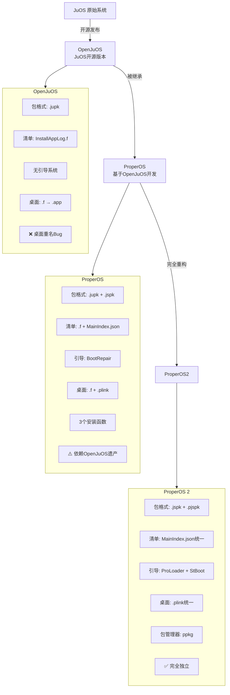
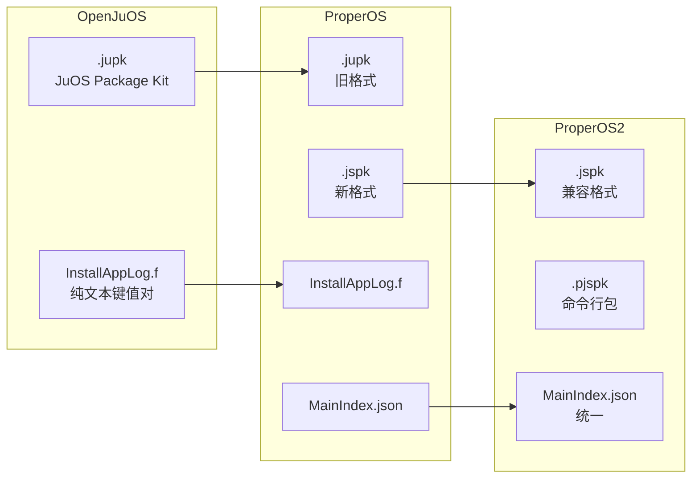
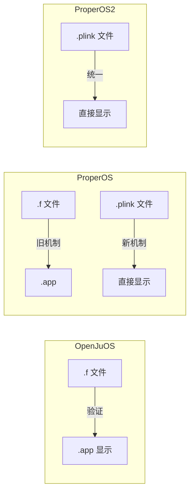
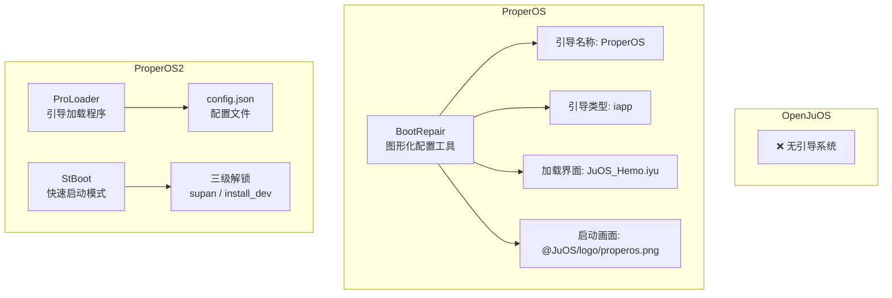
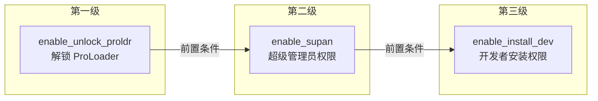
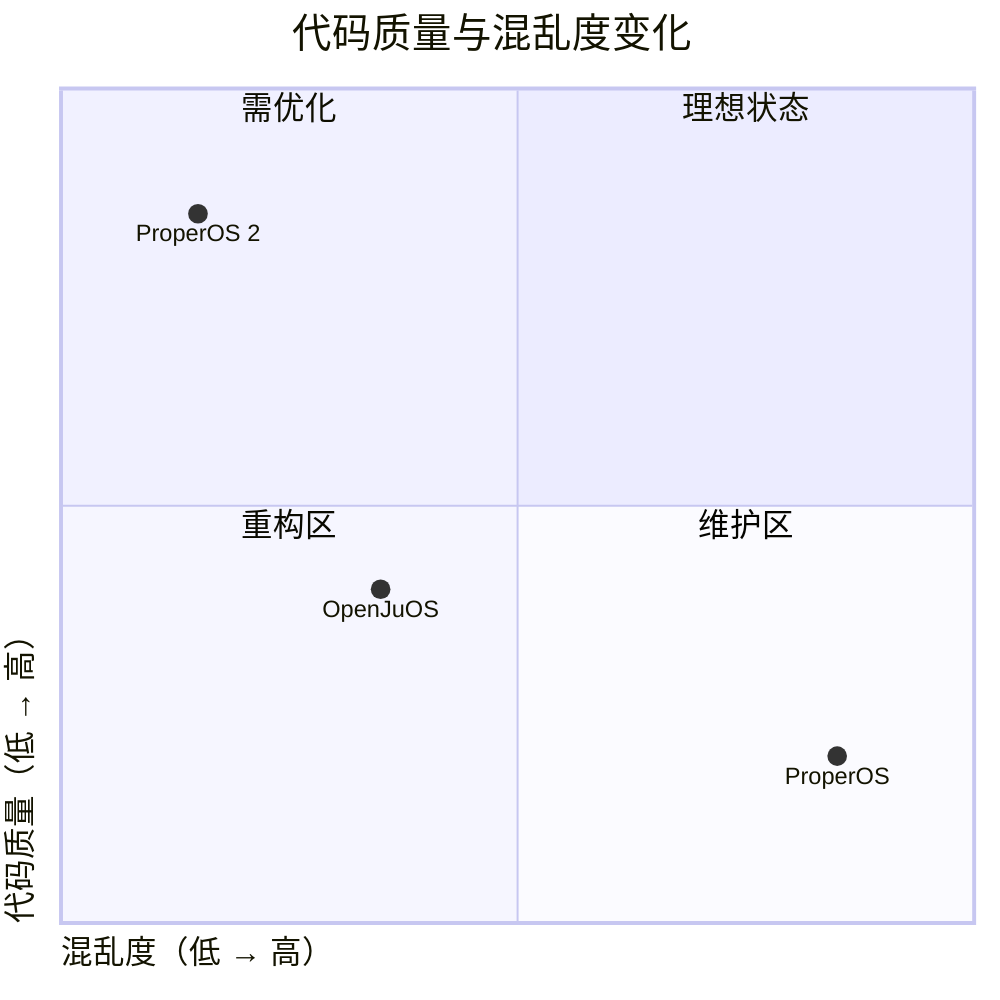

# OpenJuOS、ProperOS、ProperOS 2 完整对比总结

## 系统演进概览



---

## 一、基本信息对比

| 维度 | OpenJuOS | ProperOS | ProperOS 2 |
|:----:|:--------:|:--------:|:----------:|
| **定位** | JuOS 的开源版本 | 基于 OpenJuOS 开发的系统 | 完全重构的新系统 |
| **开发阶段** | 基础阶段 | 继承 + 叠加阶段 | 从零重构阶段 |
| **状态** | 已停止维护 | 已停止维护 | 开发中（beta 2.2.8+） |
| **许可证** | MIT | MIT | MIT → AGPL |
| **代码来源** | 原始（JuOS 开源） | 继承 OpenJuOS | 完全重写 |
| **代码质量** | 基础规范 | 屎山（继承+叠加） | 干净 |
| **维护难度** | 中 | 极高 | 低 |

---

## 二、目录结构对比

### OpenJuOS 目录结构

```text
/data/user/0/.../files/
├── App/                    # 应用安装目录
│   └── 包名/
│       ├── InstallAppLog.f # 清单文件
│       └── src/            # 应用资源
├── JuOS/                   # 系统目录
│   ├── ICON/               # 系统图标
│   ├── hemo/桌面/          # 桌面快捷方式（.f / .app）
│   └── data/               # 系统数据
├── System/                 # 系统配置（少量）
├── temp/                   # 临时目录
└── boot/                   # 启动配置（简单）
```

### ProperOS 目录结构（混乱顶峰）

```text
/data/user/0/.../files/
├── App/                    # OpenJuOS 遗产
├── JuOS/                   # OpenJuOS 遗产
├── ProperOS/               # 新增目录（功能重叠）
├── System/                 # 新增系统目录
├── ByUsi/                  # ByUsi Studio 账户
├── _RunDex/                # 运行时缓存
├── _RunDex_/               # 另一个运行时缓存
├── oat/                    # ART 编译缓存
├── boot/                   # 启动配置
├── temp/                   # ⚠️ 被滥用（存正式应用）
├── version.json
├── x / x.dex               # 播放器 SDK
└── ...                     # 12+ 顶层目录
```

### ProperOS 2 目录结构（干净）

```text
/data/user/0/.../files/
├── ProperOS/               # 用户数据
│   └── home/Desktop/       # 桌面快捷方式（统一 .plink）
├── System/                 # 系统文件
│   ├── bin/                # 系统命令（.cuk）
│   ├── Config/             # 配置文件
│   │   └── ProLoader/
│   │       └── config.json
│   ├── boot/               # 启动脚本
│   ├── icon/               # 系统图标
│   └── scv/                # 版本信息
├── user/                   # 用户数据
│   ├── data/software/      # 应用安装目录
│   ├── token.json
│   └── userinfo.json
├── temp/                   # 临时文件（只存缓存）
├── _RunDex_/               # 运行时缓存（Android 生成）
├── oat/                    # ART 编译缓存（Android 生成）
└── x / x.dex               # 播放器 SDK
```

### 目录结构对比表

| 维度 | OpenJuOS | ProperOS | ProperOS 2 |
|:----:|:--------:|:--------:|:----------:|
| **顶层目录数** | ~6-8 个 | **12+ 个** | **4 个** |
| **应用目录** | `App/` | `App/` + `temp/`（滥用） | `user/data/software/` |
| **系统目录** | `JuOS/` | `JuOS/` + `System/` + `ProperOS/` | 统一 `System/` |
| **用户目录** | 分散 | 分散 | 统一 `user/` |
| **桌面位置** | `JuOS/hemo/桌面/` | `JuOS/hemo/桌面/` | `ProperOS/home/Desktop/` |
| **临时目录** | 有 | ⚠️ 被滥用 | ✅ 只存缓存 |

---

## 三、源代码组织对比

### ProperOS 源代码问题（150+ 文件不分层）

```text
src/
├── 8421.myu                 # 数字命名
├── a.iyu, b.iyu             # 单字母命名
├── awzx.mjava, awzx2.mjava  # 无意义命名
├── home.iyu, home-cd.iyu, home-utw.iyu  # 多个版本
├── list.iyu, list1.iyu, list_2.iyu, list_3.iyu
├── 关于JuOS.iyu             # 中文命名
├── 动画.myu                 # 中文命名
├── 设置.iyu, 设置oobe.iyu, 设置启动动画.iyu
└── ...（150+ 个文件）
```

### 源代码组织对比表

| 维度 | OpenJuOS | ProperOS | ProperOS 2 |
|:----:|:--------:|:--------:|:----------:|
| **源文件总数** | ~50 | **~220** | ~80 |
| **源文件位置** | 根目录 + 简单分类 | 全部在 `src/` 不分层 | `src/` 按类型分层 |
| **命名规范** | 不统一 | 混乱（英文/拼音/中文/数字） | 规范（包名风格） |
| **中文文件名** | 可能有 | **大量存在** | ❌ 无 |
| **单字母命名** | 可能有 | `a.iyu`, `b.iyu` | ❌ 无 |
| **代码重复** | 较少 | **大量** | 无 |

---

## 四、包格式与安装对比

### 安装包格式演进



### 包格式详细对比

| 维度 | OpenJuOS | ProperOS | ProperOS 2 |
|:----:|:--------:|:--------:|:----------:|
| **安装包格式** | `.jupk` | `.jupk` + `.jspk` | `.jspk` + `.pjspk` |
| **清单文件** | `InstallAppLog.f` | `.f` + `MainIndex.json` | `MainIndex.json` |
| **安装路径** | `$App/包名/` | `$App/包名/` | `$user/data/software/` |
| **安装方式** | 扫描列表 | 扫描列表 → 多函数 | `system.install()` + `ppkg` |
| **安装函数** | 内置扫描 | `lib.install()`<br/>`system.install()`<br/>`install.install()` | `system.install()`<br/>`ppkg` |
| **包管理器** | ❌ | ❌ | ✅ `ppkg` |

### 清单文件格式对比

**InstallAppLog.f（OpenJuOS / ProperOS 旧格式）：**

```ini
AppM=人生重开模拟器=AppM
AppLj=%gcom.lifeRestart/=AppLj
AppTb=favicon.ico=AppTb
```

| 字段 | 含义 |
|:----:|:----:|
| `AppM` | 应用名称 |
| `AppLj` | 应用路径（`%g` 前缀 = `$App/`） |
| `AppTb` | 应用图标 |

**MainIndex.json（ProperOS 新 / ProperOS 2）：**

```json
{
  "name": "人生重开模拟器",
  "package": "io.github.lifeRestart",
  "icon": {
    "systemIcon": false,
    "icon": "favicon.ico"
  },
  "sign": {
    "uuid": "33010512-7376-4c8f-9f13-5d1aa9b49060",
    "byusi": {
      "uuid": "bc2095ff41ffd5d78eab216bd2fee908c9599e385276cd8858b565a8431da059",
      "email": "177828525@qq.com"
    }
  },
  "guide": "index.html"
}
```

---

## 五、桌面快捷方式对比

### 快捷方式演进



### 快捷方式对比表

| 维度 | OpenJuOS | ProperOS | ProperOS 2 |
|:----:|:--------:|:--------:|:----------:|
| **快捷方式格式** | `.f` → `.app` | `.f` + `.plink` | 统一 `.plink` |
| **快捷方式位置** | `JuOS/hemo/桌面/` | `JuOS/hemo/桌面/` | `ProperOS/home/Desktop/` |
| **重名处理** | ❌ Bug（新的覆盖旧的） | ✅ 后期修复 | ✅ 正常 |
| **验证机制** | `.f` → 验证 → `.app` | 旧机制 + 新机制 | 直接读取 |

---

## 六、引导系统对比

### 引导系统架构



### BootRepair 界面（ProperOS）

```text
ProperOS BootRepair Mode
├── 修改引导
│   ├── 引导名称: ProperOS
│   ├── 引导类型: iapp
│   ├── 被加载界面: JuOS_Hemo.iyu
│   └── 引导时显示的界面: @JuOS/logo/properos.png
├── 删除格式化数据
└── 重启设备
```

### 引导系统对比表

| 维度 | OpenJuOS | ProperOS | ProperOS 2 |
|:----:|:--------:|:--------:|:----------:|
| **引导程序** | ❌ 无 | BootRepair | ProLoader + StBoot |
| **引导功能** | 无 | 被动修复 | 主动管理 |
| **配置管理** | 无 | 图形化界面修改 | config.json + 终端 |
| **遗产依赖** | 无 | ⚠️ 依赖 `JuOS/` 目录 | ✅ 无依赖 |
| **解锁机制** | 无 | 无 | 三级解锁 |
| **工程模式** | 无 | 无 | ✅ 终端 + 命令包 |

---

## 七、命令行与终端对比

| 维度 | OpenJuOS | ProperOS | ProperOS 2 |
|:----:|:--------:|:--------:|:----------:|
| **终端** | 可能有 | 有 | 有（更完善） |
| **命令格式** | 未知 | `.cuk` | `.cuk` |
| **命令目录** | 未知 | 分散 | 统一 `System/bin/` |
| **包管理器** | ❌ | ❌ | ✅ `ppkg` |
| **命令包格式** | 无 | 无 | `.pjspk` |

---

## 八、账户与安全对比

| 维度 | OpenJuOS | ProperOS | ProperOS 2 |
|:----:|:--------:|:--------:|:----------:|
| **账户系统** | 无 | ByUsi Studio | **Cdifit** |
| **应用验证** | 无 | UUID + 邮箱 | UUID + 邮箱 + 开关 |
| **超级管理员** | 无 | 无 | **supan** |
| **安装验证开关** | 无 | 无 | `enable_install_dev` |
| **权限管理** | 无 | 基础 | 完善 |

### 三级解锁机制（ProperOS 2）



---

## 九、资源管理对比

| 维度 | OpenJuOS | ProperOS | ProperOS 2 |
|:----:|:--------:|:--------:|:----------:|
| **图片资源** | 分散 | 极其分散（多处混放） | 统一分类 |
| **字体文件** | 分散 | 分散多处 | 统一 `res/fontFile/` |
| **动画资源** | 无 | Lottie JSON（40+） | Lottie JSON |
| **第三方资源** | 无 | 散落多处 | 统一 `sdk/` |

---

## 十、技术债务对比

| 维度 | OpenJuOS | ProperOS | ProperOS 2 |
|:----:|:--------:|:--------:|:----------:|
| **历史包袱** | 无 | OpenJuOS 遗产 | 无 |
| **代码重复** | 少量 | **大量** | 无 |
| **未使用代码** | 少量 | 大量 | 无 |
| **命名冲突风险** | 低 | 高 | 低 |
| **模块耦合度** | 中 | 极高 | 低 |
| **重构可行性** | 中 | **极低** | 高 |
| **新人上手难度** | 中 | **极高** | 低 |

---

## 十一、文件数量对比

| 类型 | OpenJuOS | ProperOS | ProperOS 2 |
|:----:|:--------:|:--------:|:----------:|
| 源文件 | ~50 | **~220** | ~80 |
| 配置文件 | ~10 | ~50 | ~20 |
| 图片资源 | ~100 | **~600** | ~250 |
| 字体文件 | ~3 | ~10 | ~5 |
| 第三方库 | ~5 | ~30 | ~15 |
| 其他 | ~20 | ~100 | ~40 |
| **总计** | **~200** | **~1000+** | **~400** |

---

## 十二、代码质量与混乱度变化图



---

## 十三、总结

| 系统 | 一句话总结 |
|:----:|:----------|
| **OpenJuOS** | 基础开源版本，有桌面重名 Bug，无引导系统，代码质量一般。 |
| **ProperOS** | 继承了 OpenJuOS 的所有混乱，叠加了新功能、新目录、新格式，加上大量测试文件和中文命名，最终变成了一坨无人敢动的屎山。引导系统 BootRepair 仍然依赖 OpenJuOS 遗产。 |
| **ProperOS 2** | 扔掉所有历史包袱，从零重构，目录干净、命名规范、逻辑统一、引导独立、代码可维护。 |